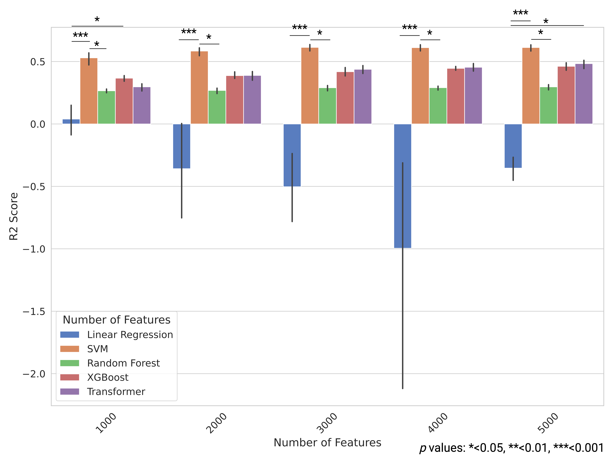
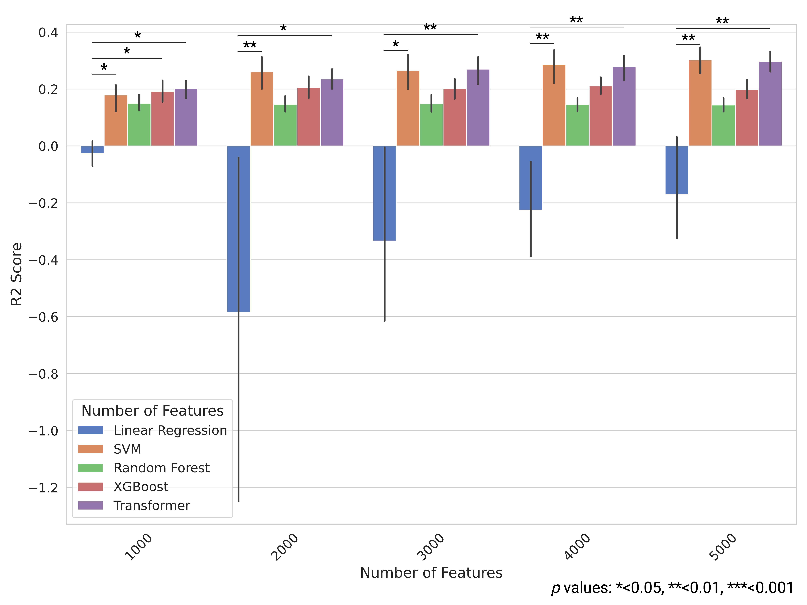

# Resilience-prediction-RNA-seq

This repository contains scripts used in the study for predicting the resilience score of Alzheimer's disease patients using RNA-seq data and various machine learning models. The study aims to build and compare regression models to accurately predict resilience scores, using data from the MSBB and ROSMAP cohorts.

## Overview
This repository contains scripts used in the study for predicting the resilience score of Alzheimer's disease patients using RNA-seq data and various machine learning models. The study aims to build and compare regression models to accurately predict resilience scores, using data from the MSBB and ROSMAP cohorts.

## Data
- Cohorts Used: [MSBB (Mount Sinai Brain Bank)](https://doi.org/10.7303/syn2580853) and [ROSMAP (Religious Orders Study and Memory and Aging Project)](https://doi.org/10.7303/syn2580853).
- Resilience Score Calculation: The resilience score is derived by subtracting the cognitive score predicted by a regression model (based on pathology scores) from the observed cognitive score.

## Models
We compared the performance of the following models:

- Support Vector Regression (SVR)
- Linear Model
- XGBoost
- Random Forest
- Transformer-based Model

## Results
Across both MSBB and ROSMAP datasets, the SVR model demonstrated the best performance in predicting resilience scores.

    

    

## Repository Contents
This repository includes scripts for:

- Data Preprocessing: Scripts to preprocess RNA-seq and related clinical data to prepare it for modeling.
- Model Training and Evaluation: Scripts for training and evaluating the regression models, including SVR, linear models, XGBoost, Random Forest, and Transformer-based models.

## Reproducibility
The provided scripts allow for the reproduction of the results as described in the paper. Ensure that you have access to the MSBB and ROSMAP datasets, and follow the instructions in the scripts to preprocess the data and run the models.

## Citation

